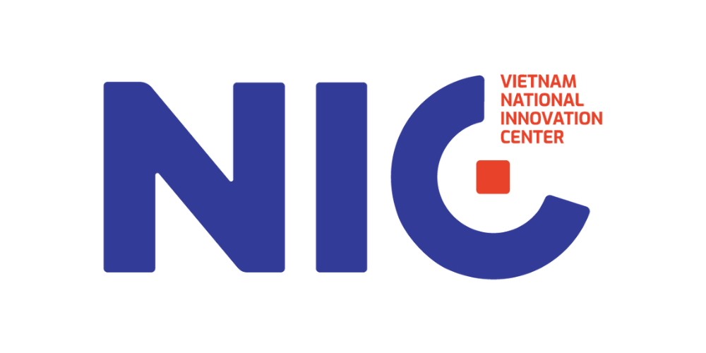

<p align="center">
  
  &nbsp;&nbsp;&nbsp;&nbsp;&nbsp;&nbsp;&nbsp;&nbsp;
  
</p>

<p align="center">
  <strong>Project was built in 48 hours for Vietnam AI Innovation Challenge Hackathon</strong>
</p>

---

## 🎯 Đề bài / Problem Statement: Policy & Grant Navigator
**National Innovation Center (NIC) • Innovation**

An AI assistant that helps startups, FDI enterprises, and high-tech companies discover relevant government policies, incentives, and funding opportunities by:
*   **Searching and interpreting** applicable laws, decrees, circulars, and government support programs based on the company’s needs.
*   **Continuously monitoring** policy updates and newly announced funding programs.
*   **Assisting organizations** in preparing and completing grant and funding application documents.

---

# P2B - Workspace AI-native Hỗ trợ Đăng ký Chương trình Tài trợ Doanh nghiệp
**P2B** là một không gian làm việc số (workspace) tích hợp trí tuệ nhân tạo (AI-native) toàn diện, giúp doanh nghiệp tự động hóa quy trình phân tích tài liệu pháp lý, đối chiếu tiêu chuẩn tài trợ và chuẩn bị hồ sơ ứng tuyển chất lượng cao.

Lập hồ sơ doanh nghiệp có trích dẫn nguồn, đối chiếu tự động với hàng trăm chính sách nhà nước và xuất đơn ứng tuyển chuẩn chỉ chỉ trong vài phút.

---

## 🔗 Demo Trực tuyến / Live Demo
Trải nghiệm phiên bản thử nghiệm trực tuyến tại: [https://p2b-zeta.vercel.app/](https://p2b-zeta.vercel.app/)

---

## Mục lục
1. [Tính năng cốt lõi & Quy trình Người dùng](#tính-năng-cốt-lõi--quy-trình-người-dùng)
2. [Chi tiết Kiến trúc Hệ thống Vector (Vector Engine Architecture)](#chi-tiết-kiến-trúc-hệ-thống-vector-vector-engine-architecture)
3. [Tổng quan Công nghệ (Tech Stack)](#tổng-quan-công-nghệ-tech-stack)
4. [Hướng dẫn Thiết lập Local (Full-Stack)](#hướng-dẫn-thiết-lập-local-full-stack)
5. [Cấu hình Biến môi trường](#cấu-hình-biến-môi-trường)

---

## Tính năng cốt lõi & Quy trình Người dùng

### 1. Khởi tạo Workspace & Lập Hồ sơ Doanh nghiệp (Company Passport)
*   **Tải tài liệu:** Doanh nghiệp tải lên các văn bản chứng minh pháp lý (Giấy phép kinh doanh, Báo cáo tài chính, Chứng nhận đầu tư...) lên vùng lưu trữ bảo mật ([Supabase Private Storage](https://supabase.com/docs/guides/storage/shared/private-buckets)).
*   **Trích xuất cấu trúc bằng AI:** Hệ thống sử dụng [Microsoft MarkItDown](https://github.com/microsoft/markitdown) để chuyển đổi PDF/Docx thành Markdown, sau đó gọi mô hình `gemini-3.1-flash-lite` để trích xuất các thông tin định dạng sẵn.
*   **Đảm bảo không ảo giác (Zero Hallucination):** Mỗi thông tin trích xuất bắt buộc phải có câu trích dẫn (`quote`) khớp chính xác từng ký tự trong văn bản gốc mới được đưa vào trạng thái Chờ Duyệt (`NEEDS_REVIEW`).
*   **Duyệt và Cập nhật:** Người dùng đối chiếu nguồn, xác nhận thông tin đúng để tạo phiên bản Hồ sơ Doanh nghiệp chính thức mới.

### 2. Động cơ Luật Điều kiện Xác định (Deterministic Eligibility Rule Engine)
*   **Không phụ thuộc vào AI (AI-free Evaluation):** Động cơ sử dụng mã nguồn Go để tính toán chính xác điều kiện của doanh nghiệp so với tiêu chuẩn chính sách (gồm các so sánh chuỗi, ngày tháng, số học phức tạp như `EQ`, `IN`, `CONTAINS`, `GT`, `GTE`, `LT`, `LTE`, `EXISTS`, `DATE_BEFORE`, `DATE_AFTER`).
*   **Phân loại trạng thái:** Kết quả trả về gồm `MET` (Đạt), `NOT_MET` (Không đạt) hoặc `MISSING_INFO` (Thiếu thông tin chứng minh).
*   **Xếp hạng tự động:** Gợi ý các chính sách hỗ trợ/tài trợ có tỷ lệ khớp cao nhất cho doanh nghiệp.

### 2.1. Multi-business & Ingestion Pipeline Dữ liệu
1.  **Multi-business Tenants:** Một tài khoản có thể sở hữu nhiều business workspace; mỗi request production phải qua membership check để bảo mật dữ liệu. Nút `Cập nhật tài liệu` tạo refresh job chỉ phân tích PDF mới, bảo toàn Passport hiện tại.
2.  **Layout-preserving PDF extraction:** Văn bản PDF chứa bảng biểu được bổ sung công cụ `pdftotext -layout` giữ quan hệ nhãn-giá trị; PDF scan/ít text chạy OCR fallback bằng `pdftoppm` + `tesseract` (`OCR_LANGUAGES` mặc định `vie+eng`).
3.  **Completeness Pass & Quality Gates:** Chạy completeness pass có mục tiêu cho các field còn thiếu và ghi nhận logs chất lượng (raw/valid/rejected candidates) thay vì logs các trường dữ liệu nhạy cảm.

### 2.2. Bộ nhớ đệm Đối chiếu & Giám sát Chính sách tự động (Cache & Policy Watchlist)
1. **Opportunity Matching Cache:** Kết quả phân tích đối chiếu tiêu chuẩn tài trợ được lưu trữ lưu động trong bảng `match_runs` của PostgreSQL. Cache tự động xóa và tính toán lại khi người dùng thay đổi dữ liệu trong Passport, giúp giảm thiểu thời gian chờ đợi.
2. **Watchlist Toggles:** Cho phép doanh nghiệp tùy biến bộ lọc cảnh báo cho từng workspace với 4 danh mục: *Chính sách mới*, *Thay đổi thời hạn*, *Chứng cứ hết hạn (Stale)*, và *Hồ sơ cận hạn*. Trạng thái cấu hình được lưu trực tiếp dưới dạng JSONB.
3. **Automated Crawler Scheduler:** Bộ quét chạy ngầm định kỳ mỗi 1 giờ (và chạy ngay khi khởi động hệ thống) để đối chiếu thay đổi của văn bản pháp luật:
   - Phát hiện chính sách mới phù hợp hồ sơ doanh nghiệp.
   - Phát hiện các cập nhật thay đổi ngày hạn chót của chính sách hiện tại.
   - Đối chiếu ngày hết hiệu lực của các văn bản pháp luật với mã băm nội dung (`content_hash`) của tài liệu minh chứng trong Passport để tự động cảnh báo chứng cứ cũ/hết hiệu lực.

### 2.3. Bản nháp Đơn ứng tuyển & Quản lý Mẫu đơn (Application Draft Caching)
1. **Mẫu đơn tùy biến:** Hỗ trợ tải lên và phân tích các mẫu đơn PDF/Docx của chính phủ, tự động trích xuất các trường thông tin cần điền bằng Gemini.
2. **Application Draft Cache:** Toàn bộ bản nháp và tiến trình chuẩn bị đơn được lưu trữ động trong bảng `application_draft_cache` của PostgreSQL, đảm bảo dữ liệu không bị mất khi tải lại trang hoặc đổi workspace.

### 3. Danh sách kiểm tra & Chuẩn bị Hồ sơ Ứng tuyển (Evidence-Gated Checklist)
*   **Sinh Checklist tự động:** Dựa trên các điều kiện luật của chính sách, hệ thống tạo checklist các văn bản bắt buộc cần nộp.
*   **Khóa hồ sơ theo bằng chứng:** Chỉ khi toàn bộ các trường thông tin quan trọng được xác minh nguồn dẫn, đơn ứng tuyển mới cho phép hoàn tất và phê duyệt.
*   **Xuất đơn PDF:** Tự động tạo và điền các mẫu đơn ứng tuyển dạng PDF/Docx chứa đầy đủ chữ ký số và bằng chứng đi kèm để nộp lên cơ quan quản lý.

---

## Chi tiết Kiến trúc Hệ thống Vector (Vector Engine Architecture)

Hệ thống Vector của P2B được thiết kế chuyên biệt để xử lý dữ liệu lớn luật pháp Việt Nam (VBPL) với hiệu năng cao nhất trên GPU local và tài nguyên tiết kiệm nhất trên CPU production.

### 1. Ingestion Pipeline & Chunking (GPU Local)
*   **Bộ lọc Whitelist:** Tự động lọc bộ dữ liệu [tmquan/vbpl-vn](https://huggingface.co/datasets/tmquan/vbpl-vn) trên Hugging Face (dựa trên cơ sở dữ liệu pháp luật chính thức [vbpl.vn](https://vbpl.vn)) theo cơ quan ban hành liên quan đến kinh tế/doanh nghiệp (Bộ Tài chính, Bộ Kế hoạch và Đầu tư, Ngân hàng Nhà nước...) kết hợp keyword pháp lý hỗ trợ.
*   **Phục hồi văn bản bị thiếu:** Với các văn bản thiếu body text, pipeline tự động kết nối qua cổng thông tin MoJ API gateway (`https://vbpl-bientap-gateway.moj.gov.vn` liên kết với [vbpl.vn](https://vbpl.vn)) để tải bản thảo XML đầy đủ.
*   **Article-level Chunking:** Tách văn bản luật chính xác theo từng **Điều** (`Điều X`), tự động xử lý inline headings lỗi không xuống dòng. Trích xuất được **19,488 chunks** từ 682 văn bản luật cốt lõi, chiều dài trung bình **1,769 ký tự/chunk**.
*   **Mã hóa đa luồng:** Chạy SentenceTransformer `intfloat/multilingual-e5-base` song song thông qua `ThreadPoolExecutor` và `ThreadedConnectionPool` trên **GPU NVIDIA RTX 3050** tại local với khóa GPU lock an toàn.

### 2. Low-Resource Embedding Engine (CPU Production)
Khi chạy thực tế trên môi trường CPU của Railway (không có GPU và giới hạn RAM):
*   **Kiến trúc CGO-free:** Go backend giao tiếp với script trợ lý Python (`calculate_embeddings.py`) thông qua luồng Standard Input (`stdin`) để tránh quá giới hạn ký tự dòng lệnh.
*   **ONNX Runtime & Tokenizers:** Thay thế toàn bộ PyTorch và Transformers bằng `onnxruntime` và Rust-based `tokenizers` để tối ưu hóa bộ nhớ: giảm thiểu tài nguyên tiêu thụ từ **1.5GB RAM xuống <60MB RAM**.
*   **8-bit Quantization:** Sử dụng phiên bản mô hình E5 đã lượng hóa 8-bit (`model_quantized.onnx`) giúp giảm dung lượng ổ đĩa từ **278MB xuống 141MB** và tăng gấp đôi tốc độ suy luận CPU với độ tương quan chính xác đạt 99.9%.
*   **Preload model khi build image:** Docker build tải model & tokenizer, chạy một inference kiểm tra, rồi đóng cache vào image. Request production đầu tiên không phụ thuộc mạng hoặc thời gian tải model.

### 3. PostgreSQL HNSW Indexing
*   Chỉ mục vector HNSW (`vector_cosine_ops`) được tối ưu hóa bằng cách tắt song song hóa bảo trì (`SET max_parallel_maintenance_workers = 0`) để xây dựng chỉ mục tuần tự, bypass thành công giới hạn bộ nhớ chia sẻ (`/dev/shm`) của các container ảo hóa trên Railway.
*   Policy matching dùng Reciprocal Rank Fusion giữa PostgreSQL full-text rank và cosine similarity 768 chiều, sau đó hợp nhất với kết quả rule engine đã review.

---

## Tổng quan Công nghệ (Tech Stack)

*   **Backend**: Go 1.26+, [go-chi/chi](https://github.com/go-chi/chi) router, `pgx/v5` PostgreSQL client, embedded SQL migrations.
*   **Frontend**: React 19, TypeScript, Vite, [TanStack Query v5](https://tanstack.com/query/latest), [Motion](https://motion.dev/) (animations), Radix UI, Vanilla CSS (biến CSS tùy chỉnh).
*   **Dịch vụ ngoài & Lưu trữ**: Supabase (Xác thực, Storage riêng tư), Railway PostgreSQL 17 (pgvector 0.8.2).
*   **Trích xuất & AI**: Microsoft MarkItDown CLI, Google Gemini API (`gemini-3.1-flash-lite`).
*   **Môi trường chạy sản phẩm (Production)**: Docker (chứa Poppler, Tesseract `vie+eng`, LibreOffice, ClamAV) chạy trên Railway; SPA hosting chạy trên Vercel.

---

## Hướng dẫn Thiết lập Local (Full-Stack)

### 1. Yêu cầu hệ thống
*   **Go** 1.24+ (hoặc 1.26)
*   **Node.js** 22+ & **npm**
*   **Python** 3.10+ (cần thiết cho local extraction worker chạy thư viện `markitdown`)
*   Cài đặt công cụ CLI và các thư viện cần thiết:
    ```bash
    pip install markitdown[pdf]==0.1.6 onnxruntime tokenizers numpy
    ```

### 2. Khởi động nhanh chế độ Phát triển (Dev Mode)
Trong chế độ phát triển mặc định (`DEV_AUTH=true`), hệ thống sử dụng bộ lưu trữ bộ nhớ (in-memory) giả lập. Bạn **không cần** kết nối PostgreSQL hay Supabase để chạy ứng dụng!

1.  **Sao chép cấu hình môi trường:**
    ```bash
    cp .env.example .env
    ```
2.  **Khởi động Backend (Go API):**
    ```bash
    make api
    # Hoặc: cd api && DEV_AUTH=true go run ./cmd/api
    ```
3.  **Khởi động Frontend (React/Vite):**
    Mở một terminal mới và chạy:
    ```bash
    make web
    # Hoặc: cd web && npm install && npm run dev
    ```
4.  Truy cập ứng dụng tại địa chỉ: `http://localhost:5173`. Header mặc định `X-Workspace-ID` được dùng để phân chia workspace độc lập.

### 3. Chạy Kiểm thử & Định dạng
*   **Chạy toàn bộ unit test:**
    ```bash
    make test
    ```
*   **Kiểm tra lỗi cú pháp và lint:**
    ```bash
    make lint
    ```
*   **Biên dịch dự án:**
    ```bash
    make build
    ```

### 4. Kết nối Cơ sở dữ liệu thật (Chế độ Production Local)
Nếu muốn chạy với PostgreSQL cục bộ hoặc môi trường Supabase:
1. Đảm bảo đặt `DEV_AUTH=false` và `VITE_DEV_AUTH=false` trong file `.env`.
2. Điền đầy đủ thông tin kết nối `DATABASE_URL` (PostgreSQL), các khóa `SUPABASE_*` và `GEMINI_API_KEY`.
3. Chạy lệnh migrate để tạo bảng:
   ```bash
   make migrate
   ```

---

## Cấu hình Biến môi trường
Chi tiết các biến môi trường cấu hình tại file `.env`:
*   `DEV_AUTH`: Thiết lập `true` để bỏ qua xác thực Supabase JWT, hữu dụng cho phát triển local.
*   `DATABASE_URL`: Đường dẫn kết nối PostgreSQL của Railway (chỉ dùng khi `DEV_AUTH=false`).
*   `SUPABASE_URL` / `SUPABASE_SECRET_KEY`: Dùng cấu hình xác thực và vùng chứa Storage.
*   `GEMINI_API_KEY`: API Key kết nối dịch vụ Google Gemini.
*   `P2B_MODEL_CACHE_DIR`: Thư mục lưu trữ cache model ONNX (mặc định sẽ lưu tại `~/.cache/p2b-embeddings`).

---
---

# P2B - AI-Native Grant Eligibility & Application Workspace
**P2B** is an AI-native workspace designed to help companies streamline the grant application process by automating document extraction, checking eligibility criteria through a deterministic rule engine, and preparing application checklists.

Instantly build verified Company Passports, automatically evaluate matching grants, and generate audit-ready applications with clear evidence provenance in minutes.

---

## 🔗 Live Demo
Experience the live application at: [https://p2b-zeta.vercel.app/](https://p2b-zeta.vercel.app/)

---

## Table of Contents
1. [Core Features & User Flows](#core-features--user-flows)
2. [Vector Engine Architecture](#vector-engine-architecture)
3. [Tech Stack Overview](#tech-stack-overview)
4. [Full-Stack Local Development Setup](#full-stack-local-development-setup)
5. [Environment Configuration](#environment-configuration)

---

## Core Features & User Flows

### 1. Onboarding & Company Passport Generation
*   **Document Upload:** Users securely upload business evidence (Business Licenses, Financial Statements, Investment Certificates) straight to Supabase Private Storage.
*   **AI-Structured Extraction:** The pipeline uses Microsoft MarkItDown to parse the documents into clean Markdown, then calls Gemini 3.1 Flash-Lite to extract canonical fields.
*   **Zero Hallucinations:** Every candidate field must map to an exact quote found in the source text to prevent AI hallucinations. Unmatched/unverified facts are flagged as `NEEDS_REVIEW`.
*   **Verification Workflow:** Users review the facts, resolve conflicts, and promote them to create a versioned, immutable Company Passport.

### 2. Deterministic Eligibility Rule Engine
*   **AI-Free Matching:** Go-based engine evaluates fields against policies using precise comparison operators (like `EQ`, `IN`, `CONTAINS`, `GT`, `GTE`, `LT`, `LTE`, `EXISTS`, `DATE_BEFORE`, `DATE_AFTER`).
*   **Evaluation Statuses:** Tracks status as `MET`, `NOT_MET`, or `MISSING_INFO` (if a field is unconfirmed).
*   **Smart Ranking:** Grants are sorted dynamically based on matching criteria scores.

### 2.1. Multi-business & Ingestion Pipeline
1.  **Multi-business Tenants:** Owners can manage and switch between multiple business workspaces with strict tenant isolation. Document update triggers incremental PDF refresh jobs without destroying existing facts.
2.  **Layout-preserving PDF extraction:** Combines layout text output for tables (`pdftotext -layout`) with custom OCR fallback using `pdftoppm` + `tesseract` (`OCR_LANGUAGES` defaults to `vie+eng`).
3.  **Completeness Pass & Quality Gates:** Target checks resolve missing facts and audit quality (raw/valid/rejected counts) without logging sensitive quotes.

### 2.2. Persistent Matching Cache & Automated Watchlist Monitoring
1. **Opportunity Matching Cache:** Matching scores and criteria results are cached persistently inside PostgreSQL `match_runs` table, avoiding redundant runs. The cache automatically invalidates and refreshes whenever the Company Passport is updated.
2. **Interactive Watchlist:** Strict workspace preferences for alerts can be toggled interactively for four distinct categories (*New Policies*, *Deadline Changes*, *Stale Evidence*, and *Upcoming Deadlines*), stored directly as a JSONB preferences column.
3. **Scheduled Crawler Worker:** A background scheduler process executes a rules pass on startup and every 1 hour to:
   - Identify new policies matching the workspace's support profile.
   - Detect deadline alterations on active policies.
   - Cross-reference expired legal document versions with active Passport evidence content hashes to flag stale evidence.

### 2.3. Application Drafts & Form Template Caching
1. **Custom Form Templates:** Users can upload custom government PDF/Docx form templates, automatically parsing and extracting template placeholders using Gemini structure extraction.
2. **Application Draft Cache:** Draft sections and progress state are persisted dynamically inside `application_draft_cache` in PostgreSQL to protect progress across browser reloads or workspace swaps.

### 3. Evidence-Gated Checklists & Applications
*   **Automated Checklist:** Generates document and info check-items mapped to policy requirements.
*   **Gated Actions:** Ensures application submission is locked until necessary evidence has been reviewed and confirmed.
*   **PDF Package Export:** Compiles confirmed fields and checklists to export a structured PDF ready for submission.

---

## Vector Engine Architecture

The P2B Vector Engine is engineered to parse the Vietnamese legal document corpus (VBPL) efficiently using local GPU for population and resource-restricted CPU runtime for production.

### 1. Ingestion Pipeline & Chunking (Local GPU)
*   **Whitelist Filtering:** Filters [tmquan/vbpl-vn](https://huggingface.co/datasets/tmquan/vbpl-vn) Hugging Face dataset (originating from [vbpl.vn](https://vbpl.vn)) by economic ministries and support keywords.
*   **Empty Text Resolution:** Connects to the official MoJ gateway (`https://vbpl-bientap-gateway.moj.gov.vn` linked to [vbpl.vn](https://vbpl.vn)) to scrape full XML drafts for empty records.
*   **Article-level Chunking:** Splits documents on semantic article levels (`Điều X`), cleaning up inline headings. Produced **19,488 chunks** from 682 documents with a mean length of **1,769 characters**.
*   **Multithreaded Encoding:** Concurrently embeds chunks using `ThreadPoolExecutor`, `ThreadedConnectionPool` and `intfloat/multilingual-e5-base` on local **NVIDIA RTX 3050 GPU** with thread-safe locking.

### 2. Low-Resource Embedding Engine (Production CPU)
*   **CGO-Free Subprocess Wrapper:** Go executes `calculate_embeddings.py` using standard inputs (`stdin`) to bypass command-line size boundaries.
*   **ONNX Runtime & Tokenizers:** Swaps PyTorch/Transformers with optimized C++/Rust implementations, slashing RAM consumption from **1.5GB to <60MB**.
*   **8-bit Quantized Model:** Loads `model_quantized.onnx` to cut storage footprint in half (141MB vs 278MB) and double inference speed on CPU with 99.9% cosine similarity preservation.
*   **Build-Time Model Preload:** Docker downloads the model and tokenizer and executes a verification inference during image build. The first production request has no model-download dependency.

### 3. PostgreSQL HNSW Indexing
*   The pgvector HNSW cosine index was successfully generated by forcing sequential builds (`SET max_parallel_maintenance_workers = 0`), preventing shared memory segment allocation failures under Railway container constraints.
*   Policy matching applies Reciprocal Rank Fusion to PostgreSQL full-text rank and 768-dimensional cosine similarity, then merges retrieved documents with reviewed rule-engine results.

---

## Tech Stack Overview

*   **Backend**: Go 1.26+, [go-chi/chi](https://github.com/go-chi/chi) router, `pgx/v5` PostgreSQL client, embedded SQL migrations.
*   **Frontend**: React 19, TypeScript, Vite, [TanStack Query v5](https://tanstack.com/query/latest), [Motion](https://motion.dev/) (animations), Radix UI, Vanilla CSS (using CSS variables).
*   **External Services & Databases**: Supabase (Auth, Private Storage), Railway PostgreSQL 17 (pgvector 0.8.2).
*   **Extraction & AI**: Microsoft MarkItDown CLI, Google Gemini API (`gemini-3.1-flash-lite`).
*   **Production Hosting**: Docker-based containers (containing Poppler, Tesseract `vie+eng`, LibreOffice, ClamAV) deployed to Railway; Vercel for SPA web hosting.

---

## Full-Stack Local Development Setup

### 1. Prerequisites
*   **Go** 1.24+ (or 1.26)
*   **Node.js** 22+ & **npm**
*   **Python** 3.10+ (required for local extraction worker running `markitdown`)
*   Install python libraries:
    ```bash
    pip install markitdown[pdf]==0.1.6 onnxruntime tokenizers numpy
    ```

### 2. Fast Dev Mode Start
By default, the workspace is configured to use development mode (`DEV_AUTH=true`) which runs with in-memory database adapters. You **do not need** a live PostgreSQL database or Supabase setup to run and play with the app locally!

1.  **Clone the environment file:**
    ```bash
    cp .env.example .env
    ```
2.  **Start the Go API Server:**
    ```bash
    make api
    # Or: cd api && DEV_AUTH=true go run ./cmd/api
    ```
3.  **Start the React Web Client:**
    In a new terminal window, run:
    ```bash
    make web
    # Or: cd web && npm install && npm run dev
    ```
4.  Open `http://localhost:5173` in your browser. The default `X-Workspace-ID` header is used to isolate workspaces.

### 3. Tests & Linters
*   **Run all tests:**
    ```bash
    make test
    ```
*   **Run syntax and lint checks:**
    ```bash
    make lint
    ```
*   **Build the full stack:**
    ```bash
    make build
    ```

### 4. Connecting a Database (Production-ready Local Run)
If you want to run with local PostgreSQL or live Supabase services:
1. Set `DEV_AUTH=false` and `VITE_DEV_AUTH=false` in your `.env` file.
2. Supply real credentials for `DATABASE_URL` (PostgreSQL), `SUPABASE_*` credentials, and `GEMINI_API_KEY`.
3. Apply migrations to initialize the database schema:
   ```bash
   make migrate
   ```

---

## Environment Configuration
Key environment configurations inside `.env`:
*   `DEV_AUTH`: Set to `true` to bypass Supabase JWT validation, ideal for quick local development.
*   `DATABASE_URL`: Connection string for Railway PostgreSQL instance (used when `DEV_AUTH=false`).
*   `SUPABASE_URL` / `SUPABASE_SECRET_KEY`: Used for authentication and bucket signing operations.
*   `GEMINI_API_KEY`: API Key for Google Gemini services.
*   `P2B_MODEL_CACHE_DIR`: Local persistent cache folder path for model files (defaults to `~/.cache/p2b-embeddings`).
